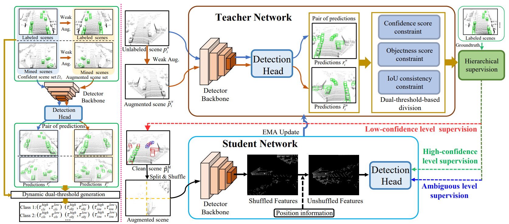

# HSSDA

## Introduction
(CVPR 2023) This repository provides an implementation of Hierarchical Supervision and Shuffle Data Augmentation for 3D Semi-Supervised Object Detection (HSSDA).
Our arXiv report is [here](https://arxiv.org/abs/2304.01464).


## Installation
Prease refer to the original [README.md](https://github.com/open-mmlab/OpenPCDet/blob/master/docs/INSTALL.md) for installation and usage of OpenPCDet.

### Data Preparation
Please download the official [KITTI 3D object detection](http://www.cvlibs.net/datasets/kitti/eval_object.php?obj_benchmark=3d) dataset and organize the downloaded files as follows (the road planes could be downloaded from [road plane](https://drive.google.com/file/d/1d5mq0RXRnvHPVeKx6Q612z0YRO1t2wAp/view?usp=sharing)):

```
HSSDA
├── data
│   ├── kitti
│   │   │── ImageSets
│   │   │── ImageSets_3dioumatch
│   │   │── training
│   │   │   ├──calib & velodyne & label_2 & image_2 & planes & depth_2
│   │   │── testing
│   │   │   ├──calib & velodyne & image_2
├── pcdet
├── tools
```

Generate the data infos by runing the following command:

```python 
python -m pcdet.datasets.kitti.kitti_dataset_full create_kitti_infos tools/cfgs/dataset_configs/kitti_dataset.yaml
```

Then, cut the generated three files  (`gt_database`, `kitti_dbinfos_train.pkl` and `kitti_infos_train.pkl`) into the `kitti/origin_label` folder.

```bash
cd data/kitti
mkdir origin_label
mv kitti_dbinfos_train.pkl origin_label/
mv kitti_infos_train.pkl origin_label/
mv gt_database origin_label/
cd ../..
```

Then, generate data split:

```bash
cd tools
python split.py <label_ratio> <split_num>
```

For example, training the PV-RCNN with 2% labeled scene:

```bash
cd tools
python split.py 0.02 1
```

Then, copy generated `kitti_dbinfos_train.pkl` and `kitti_infos_train.pkl` into the kitti data path.

```bash
cd ../data/kitti
cp semi_supervised_data_3dioumatch/scene_0.02/1/kitti_infos_train.pkl  ./
cd ../..
```

Then, generate the new `gt_database` based on the split.

```python 
python -m pcdet.datasets.kitti.kitti_dataset create_kitti_infos tools/cfgs/dataset_configs/kitti_dataset.yaml
```

### Burn-in stage

Please download the pre-trained model (pv_rcnn_0.02_1) in [Google Drive](https://drive.google.com/drive/folders/1bTE2OAlTA5vWJ4g9yhxkf_7qODSZjOpr) or run the following script for training.

```python 
cd tools
python train.py --cfg_file cfgs/kitti_models/pv_rcnn.yaml --batch_size 8 --workers 4 --extra_tag pv_rcnn_002_1
```

### Training

After the burn-in stage, copy the `semi_supervised_data_3dioumatch/scene_0.02/1/kitti_infos_train_include_unlabel.pkl` into `data/kitti` folder, and rename it as `kitti_infos_train.pkl` to replace the original pkl file.

```bash
cd ../data/kitti
cp semi_supervised_data_3dioumatch/scene_0.02/1/kitti_infos_train_include_unlabel.pkl  ./
mv kitti_infos_train_include_unlabel.pkl kitti_infos_train.pkl
```

Then, begin semi-supervised training stage

```bash
cd ../../tools
sh scripts/dist_train.sh \
--cfg_file cfgs/kitti_models/pv_rcnn_ssl.yaml \
--extra_tag <log_folder_name> --batch_size 12 \
--pretrained_model <path_to_pretrain_model> \
--labeled_frame_idx <path_to_labeled_idx_txt>
```

For example:
```bash
cd ../../tools
sh scripts/dist_train.sh \
--cfg_file cfgs/kitti_models/pv_rcnn_ssl.yaml \
--extra_tag pv_rcnn_002_1 --batch_size 12 \
--pretrained_model <path_to_pretrained_model_pv_rcnn_0.02_1> \
--labeled_frame_idx ../data/kitti/semi_supervised_data_3dioumatch/scene_0.02/1/label_idx.txt
```

Please find tunable parameters in the script.

### Acknowledgement
This code is based on [OpenPCDet](https://github.com/open-mmlab/OpenPCDet) and [3DIoUMatch](https://github.com/THU17cyz/3DIoUMatch-PVRCNN).

If you find some help for you, star is a good reward ^_^.
